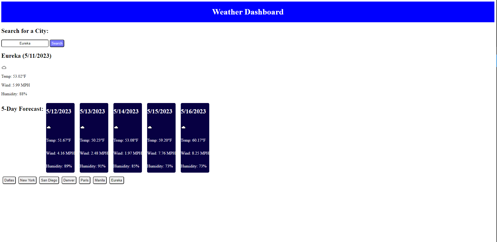

# weather-dashboard
## Screenshot of the Deployed Page

## URLs
* [Github Repository](https://github.com/SoloSolaire/weather-dashboard)
* [Deployed Page](https://solosolaire.github.io/weather-dashboard/)

## Description
This is a weather dashboard application that provides information on the user inputted location. This information is retrieve from the "OpenWeather Map" API for weather and "DayJS" for the current time. When the location is provided, it will display the current location's date, tempurature, windspeed, humidity, and an icon of the weather conditions. This app also shows a 5 day forecast with the same listed info as the main card. What was previously searched will also be recorded into the history.